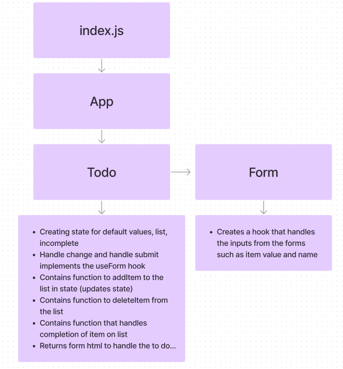

# Todo List App
Create and manage a Todo List Application.

## Phase 1 Requirements: Lab 31
In Phase 1, we’re going to perform some refactoring of a Todo application built by another team. This application mixes application state and user settings at the top level and passes things around. It was a good proof of concept, but we need to make this production ready.

1. Implement the React context API for defining settings across the entire application.
    - Create React Context for managing application display settings and provide this at the application level.
    - Add the following defaults to the context provider’s state, they will not be changeable in this lab.
        - Display three items.
        - Hide completed items using a boolean.
        - Define “difficulty” as a default sort word to optionally use in the stretch goal.

2. Consume and utilize context values throughout your components.
    - Show a maximum of three items per screen by default in the `<List />` component.
    - Use the Mantine `<Pagination />` component to allow users to navigate a list of items.
    - Hide completed items in the list by default (the ability to show will be added in a later lab).

## Phase 2 Requirements
In Phase 2, we’re going to extend the functionality of our application by allowing the user to make some decisions on how they would like the application to function. Specifically, we’ll let them make changes to 2 settings.

1. Implement the Context API to make some basic application settings available to components.
    - How many To Do Items to show at once.
    - Whether or not to show completed items.
    - Hint: if reusing the custom useForm() hook, event validation may be necessary if using any Mantine component other than `<TextInput />`.

2. Provide the users with a form where they can change the values for those settings.
    - This should be given in the form of a new component, perhaps linked to from the main navigation.
    - Hint: Use Browser Router to create the page/route/component for this.
    - Once settings are updated, render the updated settings to the right of the “form”. Consider using `<Grid />`, `<Card />`, and `<When />` components.
3. Save the users choices in Local Storage.
4. Retrieve their preferences from Local Storage and apply them to the application on startup.

## UML 
